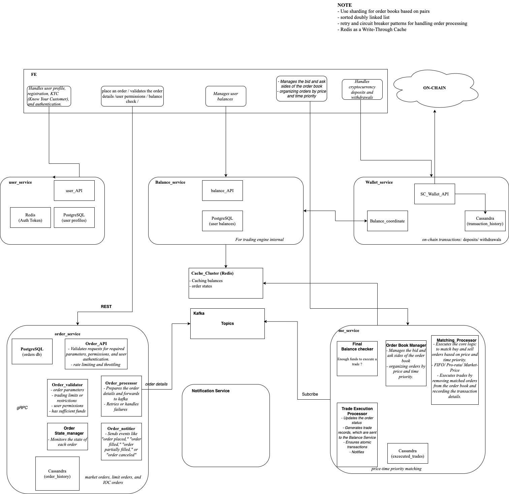

### Trading System
This repository contains a simple trading system that simulates the workflow of placing orders, matching them, and updating user balances. It includes the following services:

- Order Service: Accepts orders from users and validates them.
- Matching Engine: Matches buy and sell orders and publishes trade events.
- Balance Service: Manages user balances and updates them after trades.
- Redis: Used for caching user balances.
- PostgreSQL: Stores order and balance data.
- Kafka: Handles messaging between services.




Table of Contents
- Setup
- Services Overview
- Testing Procedure
- Expected Outcome

###  Setup
Clone the Repository

```bash
Copy code
git clone https://github.com/yourusername/trading-system.git
cd trading-system
Docker Compose Setup
```
Ensure Docker and Docker Compose are installed. Run the following command to start all services:

```
bash
Copy code
docker-compose up -d
This will start all services defined in the docker-compose.yml file.
```
Environment Configuration

Ensure that .env files or environment variables are set for each service, especially for Kafka topics, Redis and PostgreSQL connections.

### Services Overview
- Order Service
Port: 5002
Description: Accepts buy and sell orders from users, performs initial validation, and publishes orders to Kafka for processing by the Matching Engine.

- Matching Engine
Port: 5003
Description: Listens to order events from Kafka, matches buy and sell orders, and publishes trade events back to Kafka.

- Balance Service
Port: 5001
Description: Manages user balances, updates balances after trades, and interacts with Redis for quick access to balance data.
 
- Kafka
Topic: order-events and trade-events
Description: Handles order and trade event messaging between services.

- Redis and PostgreSQL
Redis: Used for caching balances in the Balance Service.
PostgreSQL: Persistent storage for orders and balances.


### Testing Procedure
Step 1: Verify Initial Balance for Testing Users
Check Balance in Balance Service:
Verify that User A (buyer) has 1000 USDT and User B (seller) has 500 ADA.

Example API call to check balance:
```bash
Copy code
curl -X GET http://localhost:5001/balance/1  # Check balance for User A
curl -X GET http://localhost:5001/balance/2  # Check balance for User B
```
Step 2: Place Buy and Sell Orders in the Order Service
Place a Buy Order:

Submit a buy order for User A to buy 100 ADA at 2 USDT per ADA.

```bash
Copy code
curl -X POST http://localhost:5002/orders -H "Content-Type: application/json" -d '{
    "user_id": 1,
    "asset": "ADA",
    "quantity": 10,
    "price": 1.9,
    "order_type": "buy"
}'
```
Place a Sell Order:

Submit a sell order for User B to sell 100 ADA at 2 USDT per ADA.

```bash
Copy code
curl -X POST http://localhost:5002/orders -H "Content-Type: application/json" -d '{
    "user_id": 2,
    "asset": "ADA",
    "quantity": 10,
    "price": 2,
    "order_type": "sell"
}'

curl -X POST http://localhost:5002/orders -H "Content-Type: application/json" -d '{
    "user_id": 2,
    "asset": "ADA",
    "quantity": 1,
    "price": 1.9,
    "order_type": "sell"
}'
```
Step 3: Verify Matching and Trade Execution in the Matching Engine
Monitor Matching Engine Logs:

Check the logs of the Matching Engine to confirm that the buy and sell orders were matched. Look for messages indicating that a trade event was published.
Check Trade Event in Kafka:

Verify that a trade event was published to trade-events with details like buy_order_id, sell_order_id, trade quantity, and trade price.

Step 4: Verify Balance Updates in Balance Service
Check Balance Updates:
After the trade, use the Balance Service API to check if balances were updated correctly.

Expected Result:

User A: 1000 - (100 * 2) = 800 USDT, and 100 ADA.
User B: 100 USDT, and 500 - 100 = 400 ADA.

```bash
Copy code
curl -X GET http://localhost:5001/balance/1  # Check updated balance for User A
curl -X GET http://localhost:5001/balance/2  # Check updated balance for User B

```

Step 5: Verify Order Status in Order Service
Check Order Status:
Confirm the order statuses for both orders to ensure they are marked as "filled" or "completed".

```bash
Copy code
curl -X GET http://localhost:5002/orders/<buy_order_id>
curl -X GET http://localhost:5002/orders/<sell_order_id>
```

Step 6: Final Validation and Cleanup
Verify Data Consistency:

Ensure all balances and orders reflect the expected states after the trade.
Clean Up Test Data (Optional):

Reset balances in Redis and remove test orders from PostgreSQL if re-running the test is required.

### Expected Outcome
End-to-End Success: The entire flow should execute without errors, with each service completing its role.
Updated Balances: User balances in the Balance Service reflect the trade results.
Order Completion: Orders in the Order Service are marked as filled or completed.
Trade Event: The Matching Engine successfully published the trade event to Kafka, which triggered balance updates in the Balance Service.
This procedure tests the full lifecycle of an order in the trading system, verifying integration across the Order Service, Matching Engine, and Balance Service.

